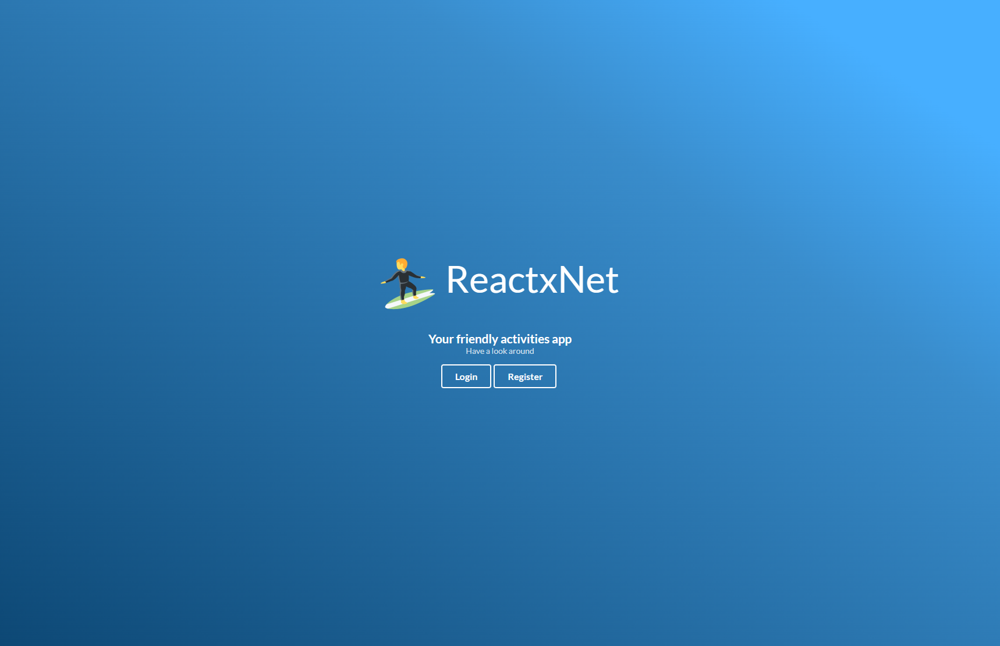
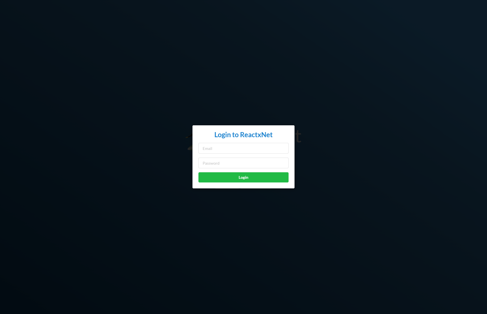
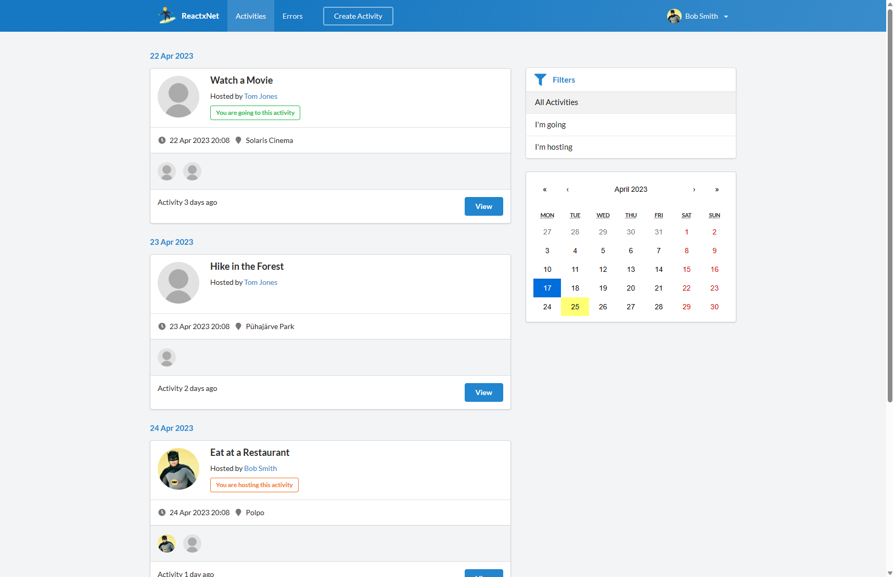
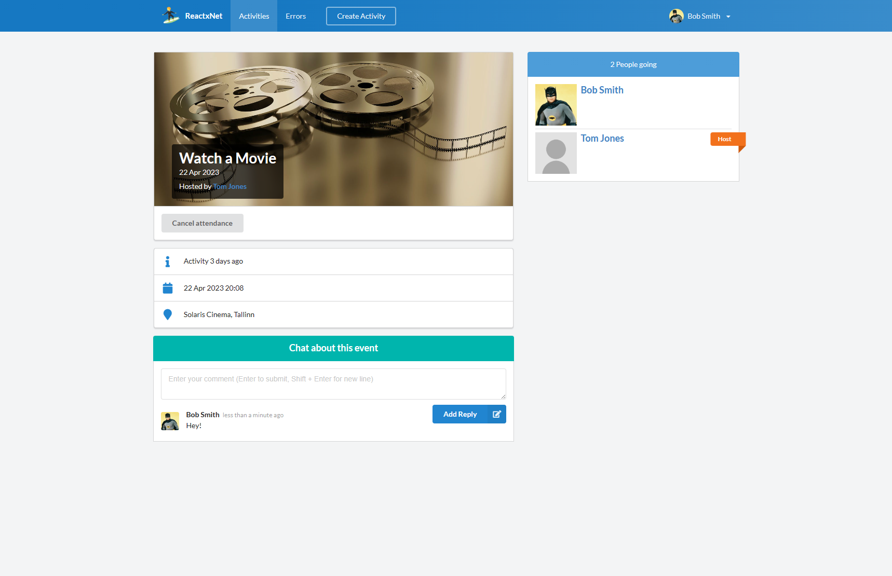
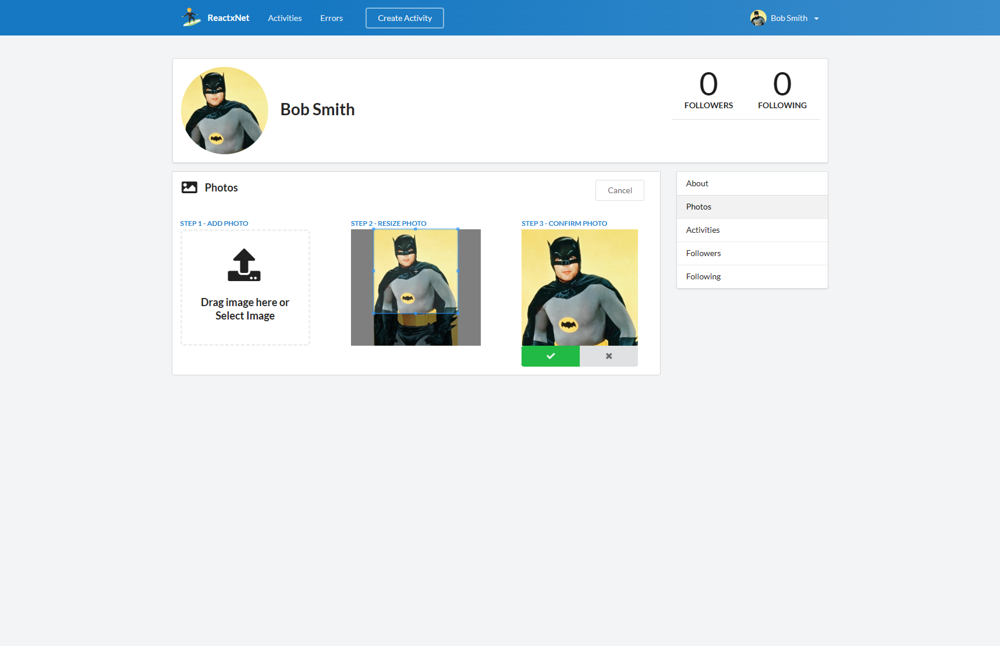
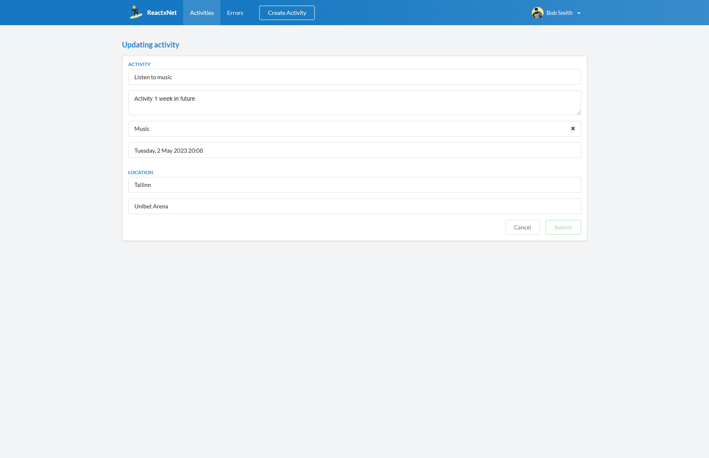

# ReactxNet

A demo project for a [React](https://react.dev/) with a [.NET API](https://dotnet.microsoft.com/en-us/apps/aspnet/apis).
Uses [MobX](https://mobx.js.org/) for state management, and [Semantic UI](https://react.semantic-ui.com/) for
components.
In the project, a user can manage their activities or join other users' activities.

UI is bundled together with the API for convenience, but it should be served via a proper web server,
e.g. nginx, and behind a reverse proxy in "production".

|  |  |  |
|------------------------------------|------------------------------------|------------------------------------|
|  |  |  |

## Setup

- Docker: https://docs.docker.com/get-docker/
- .NET 7 SDK: https://dotnet.microsoft.com/download/dotnet/7.0
- Node.js LTS version: https://nodejs.org/en/
- Pnpm package manager: https://pnpm.io/installation
- .NET EF Core tools: `dotnet tool install --global dotnet-ef`
- `cp ./API/.env.example ./API/.env` and update the values

### Run

```bash
# Inside the project directory

docker compose up -d # To start the database
dotnet watch --project ./API # To run the API and apply EF Core migrations
cd ./Web # Go to the Web UI directory
pnpm install # Install dependencies
pnpm dev # Run the Web UI
```

## Notes

### Production

To run the app in production, the following steps are required:

1. Build docker image from Dockerfile (frontend and backend will be together in the image)
2. Push the image to a registry (e.g. Docker Hub)
3. Deploy the image to a server (e.g. fly.io)

#### Docker

Docker is used to have easy access to a database in development,
and to deploy the app to production on (fly.io)[https://fly.io].

```bash
# To build for production (might not work on arm64)
docker build -t azdanov/reactxnet .

# To run the production image
docker run --rm -it -p 8080:80 --env-file .\API\.env --name reactxnet azdanov/reactxnet
# NB: To test locally when docker-compose is running, change the DefaultConnection.Host to "host.docker.internal".
# And run build:api in the Web UI directory.

# Push the image to Docker Hub
docker login
docker push azdanov/reactxnet:latest
```

#### Fly.io

Fly.io is used to deploy the app to production.

- Install the flyctl CLI: https://fly.io/docs/hands-on/install-flyctl/
- Sign up for an account: `fly auth signup`
- Login to the CLI: `fly auth login`
- Launch the app (only DB, don't deploy yet): `fly launch --image azdanov/reactxnet:latest`
- Modify the `fly.toml` file to have the following content:
  ```toml
  [env]
      ASPNETCORE_URLS = "http://+:8080"
  ```
- Set App secrets: `fly secrets set KEY=VALUE`
- Deploy the app: `fly deploy`

#### GitHub Actions

GitHub Actions are used to build and push the docker image to Docker Hub
and deploy the app to fly.io on every push to repository.

Before using the GitHub Actions, the following secrets should be set in the repository settings:

- `FLY_API_TOKEN`
- `DOCKERHUB_USERNAME`
- `DOCKERHUB_TOKEN`

#### Security Headers

The app uses [NWebSec](https://github.com/NWebsec/NWebsec) to set security headers.
Make sure that all the CSPs are set correctly, and there are no errors in the console.

### Noteworthy NPM Packages

- [date-fns](https://github.com/date-fns/date-fns) - Modern JavaScript date utility library.
- [MobX](https://github.com/mobxjs/mobx) - Simple, scalable state management.
- [Formik](https://github.com/jaredpalmer/formik) - Build forms in React, without tears.
- [React Router](https://github.com/remix-run/react-router) - Declarative routing for React.
- [Semantic UI React](https://github.com/Semantic-Org/Semantic-UI-React) - The official Semantic-UI-React integration.

### Noteworthy NuGet Packages

- [Mediator](https://github.com/martinothamar/Mediator) - A high performance implementation of Mediator pattern in .NET
  using source generators.
  The API and usage are mostly based on the great [MediatR](https://github.com/jbogard/MediatR) library,
  with some deviations to allow
  for better performance.
- [Mapperly](https://github.com/riok/mapperly) - A .NET source generator for generating object mappings. No runtime
  reflection. Inspired by MapStruct.
- [FluentValidation](https://github.com/FluentValidation/FluentValidation) - A validation library for .NET that uses a
  fluent interface and lambda expressions for building strongly-typed validation rules.

### EF Core

Project uses EF Core and the migrations are created in the `Persistence` project.

Migrations
are [automatically applied](https://learn.microsoft.com/en-us/ef/core/managing-schemas/migrations/applying?tabs=vs#apply-migrations-at-runtime)
in development when the API is started.

1. Install the EF Core tools: `dotnet tool install --global dotnet-ef`

#### Creating EF Core migrations

1. Create a migration: `dotnet ef migrations add InitialCreate -s API -p Persistence`
2. Update the database: `dotnet ef database update -s API -p Persistence`

#### Revert EF Core migrations

1. Revert the migration: `dotnet ef database update 0 -s API -p Persistence`
2. Delete the migration: `dotnet ef migrations remove -s API -p Persistence`
3. Update the database: `dotnet ef database update -s API -p Persistence`

#### EF Core drop database

1. Drop the database: `dotnet ef database drop -s API -p Persistence`